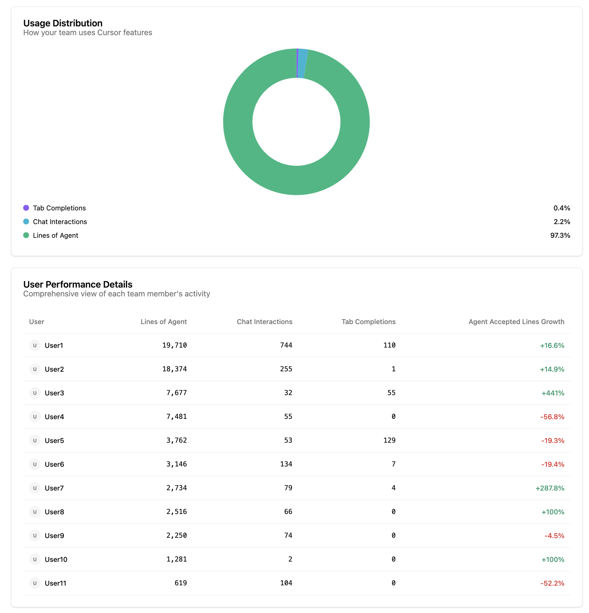

# Cursor Analytics Portal

A Python-based dashboard generator for analyzing Cursor AI usage within teams. Generate beautiful HTML reports showing usage statistics, trends, and team insights.

## Screenshots

Here's what the dashboard looks like:

### Main Dashboard Overview


### Weekly Activity Trends


### Performance Metrics & Leaderboards



## Features

- **Team Analytics**: Generate comprehensive usage reports for your entire team
- **Predefined Groups**: Create reports for specific groups (AI Champions, Engineering, QA, etc.)
- **Interactive Dashboards**: Beautiful HTML reports with charts and visualizations
- **Flexible Filtering**: Include/exclude specific users, analyze custom date ranges
- **Command Line Interface**: Easy-to-use CLI for quick report generation

## Quick Start

### Prerequisites

- Python 3.8+
- [uv](https://docs.astral.sh/uv/) package manager

### Installation

1. **Clone the repository**:

   ```bash
   gh repo clone galprz/cursor-analytics
   cd cursor-analytics
   ```

   Or using git directly:

   ```bash
   git clone https://github.com/galprz/cursor-analytics.git
   cd cursor-analytics
   ```

2. **Install dependencies**:

   ```bash
   uv sync
   ```

3. **Set up environment variables**:
   ```bash
   cp .env.example .env
   ```
   Edit `.env` and add your configuration (see [Environment Setup](#environment-setup))

### Basic Usage

```bash
# Generate report for all team members
uv run python generate_live_dashboard.py

# Generate report for AI Champions group
uv run python generate_live_dashboard.py --group ai_champs

# Generate report for specific group with custom time period
uv run python generate_live_dashboard.py --group engineering --days 14

# List all available groups
uv run python generate_live_dashboard.py --list-groups
```

## Environment Setup

Create a `.env` file in the project root with the following variables:

```bash
# Cursor Admin Authentication Cookie
# Required: Get this from your browser's developer tools when logged into Cursor Admin
CURSOR_COOKIE_STRING="your_cookie_string_here"

# Team Configuration
# Required: Your team ID from Cursor Admin
CURSOR_TEAM_ID=1234567

# Report Configuration (Optional)
# Default number of days to analyze
DEFAULT_DAYS=7

# Optional: Custom excluded emails (comma-separated)
EXCLUDED_EMAILS="user1@example.com,user2@example.com"
```

### Getting Your Cookie String

1. Log into [Cursor Admin Dashboard](https://cursor.com/admin)
2. Open Developer Tools (F12)
3. Go to Network tab
4. Refresh the page
5. Find any request to `cursor.com`
6. Copy the entire `Cookie` header value
7. Add it to your `.env` file as `CURSOR_COOKIE_STRING`

### Finding Your Team ID

1. In Cursor Admin Dashboard, check the URL
2. The team ID appears in URLs like: `https://cursor.com/admin/team/1234567`
3. Use that number as your `CURSOR_TEAM_ID`

## Predefined Groups

Configure team groups in `generate_live_dashboard.py`:

```python
PREDEFINED_GROUPS = {
    "ai_champs": [
        "user1@example.com",
        "user2@example.com",
        # Add your AI champions here
    ],
    "engineering": [
        # Add engineering team emails
    ],
    "management": [
        # Add management team emails
    ],
    # ... other groups
}
```

## Available Commands

### Basic Commands

```bash
# All team members (default)
uv run python generate_live_dashboard.py

# Specific group
uv run python generate_live_dashboard.py --group ai_champs
uv run python generate_live_dashboard.py -g engineering

# Custom time period
uv run python generate_live_dashboard.py --days 30
uv run python generate_live_dashboard.py -d 14

# List available groups
uv run python generate_live_dashboard.py --list-groups

# Custom team ID
uv run python generate_live_dashboard.py --team-id 1234567
```

### Combined Examples

```bash
# AI Champions report for last 30 days
uv run python generate_live_dashboard.py -g ai_champs -d 30

# Engineering team report for last 14 days
uv run python generate_live_dashboard.py -g engineering -d 14

# Management report with custom team ID
uv run python generate_live_dashboard.py -g management --team-id 1234567
```

## Output

Reports are generated in the `reports/` directory with timestamped filenames:

```
reports/
├── cursor_analytics_live_ai_champs_20240705_1556.html
├── cursor_analytics_live_engineering_20240705_1627.html
└── cursor_analytics_live_all_20240705_1641.html
```

## Dashboard Features

### 📊 Key Metrics

- **Lines of Agent**: Total lines of AI-generated code
- **Chat Interactions**: Number of chat sessions with Cursor AI
- **Tab Completions**: Autocomplete suggestions accepted
- **Active Users**: Team members using Cursor regularly

### 📈 Interactive Charts

- **Weekly Trends**: Line charts showing activity over time
- **User Filtering**: Toggle individual users on/off in charts
- **Multiple Views**: Switch between Lines, Chats, and Completions
- **Growth Tracking**: Week-over-week percentage changes

### 🏆 Leaderboards

- **Top Performers**: Ranked by total lines of agent code
- **Growth Champions**: Biggest week-over-week improvements
- **Persistence Leaders**: Most consistent daily usage (500+ lines/day)

### 📋 Detailed Tables

- **User Performance**: Comprehensive metrics per team member
- **Usage Distribution**: Pie chart showing feature adoption
- **Export Functionality**: Download data as JSON for further analysis

## Project Structure

```
cursor-analytics-portal/
├── cursor_admin_sdk/          # Cursor Admin API SDK
│   ├── client.py             # Main API client
│   ├── models.py             # Data models
│   └── exceptions.py         # Custom exceptions
├── generate_live_dashboard.py # Main dashboard generator
├── email_mapping.json        # User email to ID mappings (auto-generated)
├── reports/                  # Generated HTML reports
├── screenshots/              # Dashboard screenshots
├── .env                      # Environment configuration
└── pyproject.toml           # Project dependencies
```

## Troubleshooting

### Authentication Issues

**Error**: `CursorAuthError: Authentication failed`

**Solutions**:

1. Refresh your cookie string from browser
2. Ensure you're logged into Cursor Admin
3. Check cookie expiration

### Group Not Found

**Error**: `Group 'xyz' not found`

**Solutions**:

1. Run `--list-groups` to see available groups
2. Check spelling of group name
3. Add the group to `PREDEFINED_GROUPS` if needed

### Empty Reports

**Issue**: Report shows no data

**Solutions**:

1. Verify team ID is correct
2. Check if users have any Cursor usage in the specified period
3. Ensure email addresses in groups are correct

## Development

### Adding New Groups

1. Edit `PREDEFINED_GROUPS` in `generate_live_dashboard.py`
2. Add group name and email list:
   ```python
   "new_group": [
       "user1@example.com",
       "user2@example.com"
   ]
   ```

### Customizing Reports

- Modify HTML templates in `_generate_template_inline()` method
- Adjust chart configurations in the template
- Add new metrics by extending the analytics aggregation

## Contributing

1. Fork the repository
2. Create a feature branch
3. Make your changes
4. Test thoroughly
5. Submit a pull request

## License

This project is licensed under the Apache License 2.0 - see the [LICENSE](LICENSE) file for details.

## Support

For issues and questions:

1. Check the troubleshooting section
2. Review existing issues
3. Create a new issue with detailed information
